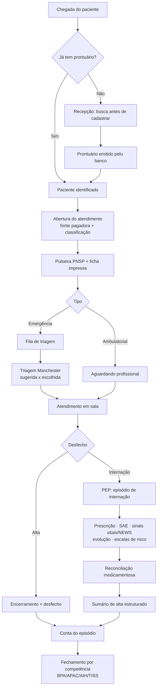
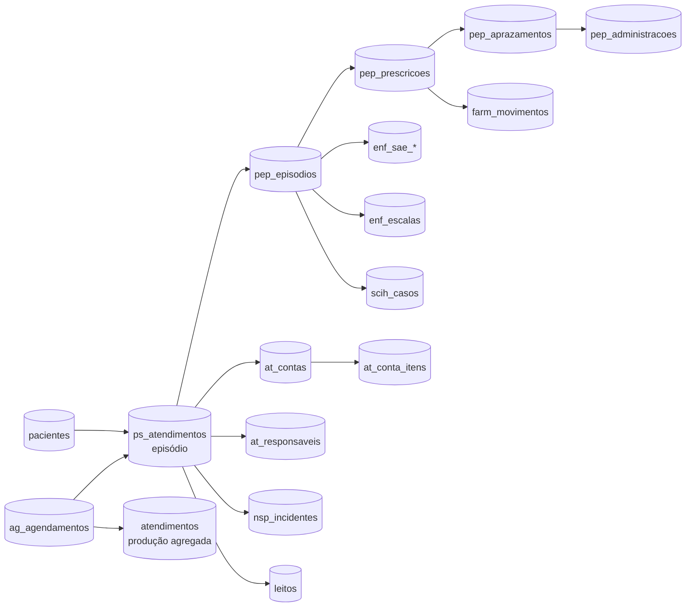

# Valentrax — Documentação Técnica e Comercial

**Sistema de Gestão Operacional Hospitalar**
Hospital Nossa Senhora de Navegantes (HNSN) · versão de 2026-08-01 · `main` em `e3a128b`

> Este documento substitui `documentacao-valentrax.html/pdf` (2026-07-20), que ficou defasado.
>
> **Sobre a honestidade deste documento.** Ele descreve o que o sistema **faz hoje**, e
> marca explicitamente o que **não faz** e o que **está planejado**. A seção de
> Integrações em especial contraria a expectativa usual de um material comercial: ela
> lista ausências. Isso é deliberado — num processo de compra hospitalar, capacidade
> prometida e não entregue aparece na implantação, quando o custo de corrigir é o
> contrato.

---

## Sumário

1. [Visão Geral](#1-visão-geral)
2. [Arquitetura e Tecnologias](#2-arquitetura-e-tecnologias)
3. [Fluxo de Funcionamento](#3-fluxo-de-funcionamento)
4. [Funcionalidades Detalhadas por Módulo](#4-funcionalidades-detalhadas-por-módulo)
5. [Modelo de Dados](#5-modelo-de-dados)
6. [Integrações](#6-integrações)
7. [Requisitos](#7-requisitos)
8. [Manutenção e Suporte](#8-manutenção-e-suporte)
9. [Plano Comercial](#9-plano-comercial)
10. [Limitações Conhecidas](#10-limitações-conhecidas)

---

## 1. Visão Geral

### O que é

O **Valentrax** é uma plataforma web de gestão operacional hospitalar (HIS enxuto)
que cobre a jornada do paciente da porta de entrada à alta: recepção, agenda
ambulatorial, pronto-socorro com triagem de Manchester, prontuário eletrônico,
enfermagem, farmácia clínica, estoque, leitos, centro cirúrgico, controle de
infecção, segurança do paciente e faturamento.

Foi construído **dentro de um hospital em operação**, com a modelagem assistencial
feita por uma enfermeira e a engenharia por um desenvolvedor — não a partir de um
levantamento de requisitos externo. Isso explica a característica central do produto:
as regras de negócio são regras **normativas brasileiras** (COFEN, CFM, ANVISA,
Ministério da Saúde), implementadas e testadas, não parâmetros configuráveis.

### Público-alvo

| Perfil | Aderência |
|---|---|
| Hospital de pequeno e médio porte (50–200 leitos) | **Alta** — é o porte para o qual foi desenhado |
| Hospital filantrópico / Santa Casa com forte componente SUS | **Alta** — o modelo de fonte pagadora e a agenda regulada (GERCON) são nativos |
| Hospital que já tem MV/Tasy e quer camada de segurança clínica | **Média-alta** — ver [Plano Comercial](#9-plano-comercial), Modelo B |
| Hospital de grande porte / rede | **Baixa hoje** — ver [Limitações](#10-limitações-conhecidas), restrição de escala |

### Diferenciais

O sistema **não** compete em faturamento, compliance fiscal ou interoperabilidade —
onde os HIS consolidados são fortes. Ele se diferencia em quatro pontos:

**1. Motor de alertas de farmácia clínica.** Dose máxima, interação medicamentosa
cruzada com a conduta, critérios de Beers (idoso), ajuste renal e hepático,
compatibilidade em Y, viabilidade por sonda. É lógica pura, testada, e vive num
módulo destacável (`src/clinico/alertas.js`).

**2. Rastro de decisão que os concorrentes não capturam.** A triagem registra a
classificação **sugerida pelo sistema** e a **escolhida pelo profissional**, separadas.
Isso é dado de auditoria e de treinamento que não existe quando o sistema só guarda o
resultado final.

**3. Segurança clínica embutida como regra dura, não como configuração.**
Exemplos que o sistema recusa, e não apenas avisa:
- técnico de enfermagem não assina diagnóstico de enfermagem (COFEN 736/2024) — sem override;
- atendimento pelo SUS não é cobrado do paciente, em nenhuma hipótese — checado na tela, na regra e por `CHECK` no banco;
- abaixo de 2 anos, o sistema **recusa** idade aproximada para triagem em vez de estimar faixa de sinais vitais;
- curador/tutor exige número de processo judicial (Lei 13.146/2015).

**4. Registro clínico append-only, verificado.** Evoluções, prescrições, checagens e
o PEP inteiro são imutáveis; correção é registro novo com `corrige_id`. Testado: nem
um `adm_master` apaga pela API.

### Maturidade — declaração explícita

- ✅ **Publicado e em uso operacional** no HNSN, com deploy contínuo.
- ✅ **1.007 testes automatizados**, CI bloqueando merge.
- ⚠️ **Ainda não há registro de paciente real no banco.** A base está povoada com
  dados de teste e de configuração. O sistema é usado para operação e validação; a
  virada para dado real depende dos itens em [Limitações](#10-limitações-conhecidas).

---

## 2. Arquitetura e Tecnologias

### Stack

| Camada | Tecnologia |
|---|---|
| Front-end | React 18 · Vite 7 · JavaScript/JSX (sem TypeScript) |
| Gráficos | Recharts |
| Testes | Vitest 3 — 1.007 testes, 34 arquivos |
| Banco de dados | PostgreSQL (Supabase) |
| Autenticação | Supabase Auth (JWT, refresh automático) |
| API | PostgREST (REST gerado do schema) |
| Funções server-side | Supabase Edge Functions (Deno) |
| Hospedagem | Vercel (deploy automático por merge na `main`) |
| CI | GitHub Actions — valida SQL, roda testes e build antes do merge |

### Princípio arquitetural: três camadas por módulo

```
regras puras  →  acesso a dados  →  tela
(sem React,      (todo INSERT/       (só desenho)
 sem rede)        UPDATE passa aqui)
```

**Por que as regras vêm primeiro e puras:** regra pura é testável por mutação — dá
para quebrá-la de propósito e verificar que o teste falha. Regra dentro de componente
React só é testável levantando o navegador e, na prática, não é testada.

**Por que toda escrita passa por uma camada de dados:** o PostgREST recusa um `INSERT`
inteiro quando uma chave não é coluna real — e devolve isso **em silêncio**. Um
`contrato-banco.test.js` por módulo confere cada coluna gravada contra a auditoria do
schema. Existe porque duas telas gravavam em colunas inexistentes: o profissional
clicava em salvar, nada era gravado, e passou por code review, build e 99 testes verdes.

### Organização do código

| Diretório | Conteúdo |
|---|---|
| `src/clinico/` | 17 módulos de lógica clínica pura: alertas de farmácia, alergias, alta, reconciliação, escalas de enfermagem, SAE, pediatria, obstetrícia, NSP, leitos, papéis profissionais |
| `src/atendimento/` | Módulo Atendimento completo (recepção, agenda, consultas, faturamento, impressos, produção) |
| `src/prontuario/` | PEP: prontuário do internado, prescrição, anamnese, reconciliação, alta, SAE, escalas |
| `src/acesso/` | Perfis, permissões, catálogo de módulos, sessão |
| `src/pacientes/` | Identidade do paciente, cadastro |
| `src/ambulatorio/` | Especialidades pactuadas e metas |
| `src/util/` | Datas e formatação |
| `supabase/` | 58 arquivos SQL: schema base + migrações incrementais + geradores |

### Segurança

- **RLS (Row Level Security) ativo em todas as tabelas** — nenhuma acessível sem login.
- **Três eixos de permissão, deliberadamente separados:**

| Eixo | Responde | Onde vive |
|---|---|---|
| `role` | quanto a pessoa mexe no **sistema** | `profiles.role` |
| `categoria` | o que ela pode fazer **clinicamente** | `profiles.categoria` + `papeis.js` |
| `perfil` | **quais módulos** ela enxerga | `profiles.perfil` + `perfis_permissoes` |

  **Poder administrativo não concede competência assistencial.** Um administrador não
  assina evolução médica nem dá alta.

- **Gravação nunca sai sem credencial de usuário** — chamada anônima é bloqueada antes
  da rede, com mensagem que diz a verdade ("a gravação NÃO foi enviada").
- **Chave `service_role` nunca vai para o front-end.** Operações privilegiadas ficam em
  Edge Functions.
- **A leitura do banco obedece ao perfil.** Cada tabela tem política de `SELECT` que
  chama `public.pode_ver(<módulo>)`: tirar um módulo do perfil tira também o acesso pela
  API, não só o item do menu. Recepção, faturamento e almoxarifado não alcançam o
  prontuário nem por fora da tela (COFEN 754/2024, art. 6º). O mapa de qual módulo lê
  qual tabela é versionado (`src/acesso/mapa-tabelas.js`) e um teste impede que tabela
  nova entre sem classificação.
- ⚠️ **Duas ressalvas, declaradas:** o RLS **não filtra linha** (quem abre o prontuário
  abre o de qualquer paciente, não só os do seu setor) e a **escrita** ainda é decidida
  por papel de sistema, não por módulo. Ver [Limitações](#10-limitações-conhecidas).

---

## 3. Fluxo de Funcionamento

### Jornada do paciente



### Fluxo de dados entre módulos



### Ciclo de publicação

```
1. branch + código
2. rodar o SQL no banco DEMO          ← painel do Supabase
3. testar no preview do demo
4. deu certo? rodar o MESMO SQL no PRINCIPAL
5. só então: merge do código → Vercel publica sozinha
```

A ordem dos passos 4 e 5 não é opcional: o **código** sobe sozinho ao mergear, o
**banco não**. Invertendo, a tela nova chega procurando coluna que ainda não existe.

---

## 4. Funcionalidades Detalhadas por Módulo

### 4.1 Atendimento

Porta de entrada do hospital. Cinco abas.

| Aba | Usuário | Função |
|---|---|---|
| **Recepção** | recepcionista | identifica o paciente, emite prontuário, abre o atendimento com fonte pagadora, corrige e cancela |
| **Agenda** | recepção do ambulatório | grade de vagas, marcação, painel do dia, conciliação de produção, relatório mensal |
| **Consultas** | recepção | pesquisa: histórico do paciente, período, número do atendimento |
| **Faturamento** | faturista | conta do episódio, itens, via de faturamento, fechamento por competência |
| **Tabelas** | analista comercial | convênios, planos, procedimentos e domínios — sem SQL |

**Regras que estruturam o módulo:**

- **A tela começa pela busca, não pelo cadastro.** Com fila no balcão, quem atende
  preenche o formulário aberto em vez de procurar quem já existe — é assim que nasce
  prontuário duplicado.
- **O número do prontuário é emitido pelo banco** (sequência atômica). Dois
  recepcionistas em dois computadores calculariam o mesmo "maior + 1".
- **A vaga da agenda tem dono:** regulação (GERCON), marcação interna ou ordem de
  chegada. Marcar internamente em vaga da regulação é **recusado**. A recepção pode
  *transcrever* o que a central marcou — exigindo o número do protocolo, que é o que
  separa transcrever de ocupar cota alheia.
- **Nenhuma pendência administrativa segura paciente na porta.** Carteirinha esquecida,
  convênio não cadastrado e CBO incompatível aparecem como aviso. No **fechamento da
  conta**, as mesmas pendências bloqueiam — momentos diferentes, consequências diferentes.
- **Pulseira de identificação (PNSP, Portaria MS 529/2013):** mínimo de dois
  identificadores; localização (leito, quarto, box) **nunca** identifica; iniciais e
  "NÃO IDENTIFICADO" não contam como identificador; nada de clínico vai para o pulso.
  A impressão nunca é bloqueada — falta de identificador vira carimbo na própria pulseira.
- **Responsável do episódio:** quem consente e a quem o paciente pode ser entregue.
  Idade decide o papel (Código Civil arts. 3º e 4º); curatela exige processo judicial;
  acompanhante não consente nem recebe alta.

### 4.2 Pronto-Socorro

- **Triagem de Manchester adaptada** ao protocolo do HNSN, com cinco níveis e
  tempos-alvo oficiais da unidade.
- **Classificação sugerida × escolhida** registrada separadamente.
- **Faixas pediátricas e obstétricas** de sinais vitais, por idade em meses e por
  discriminadores (pré-eclâmpsia).
- **Painel da emergência**: fila por prioridade, quem está fora do tempo-alvo, salas
  ocupadas, censo (com distinção entre vaga que conta no censo do hospital e retaguarda).
- Prescrição, administração e checagem de medicação no PS.
- Relatório mensal com jornada do paciente e BI de exames por categoria.

### 4.3 Prontuário Eletrônico (PEP)

Cobertura de internação, em três fases concluídas:

- **Episódio de internação**, anamnese, evoluções, anotações de enfermagem.
- **Prescrição do internado** com aprazamento e checagem à beira do leito.
- **Sinais vitais seriados com NEWS** (score de alerta precoce) calculado.
- **Alergia como atributo da pessoa** (não da passagem), com distinção entre "nega
  alergias" (alguém perguntou) e "sem registro" (ninguém perguntou).
- **Condições e problemas** ativos.
- **Reconciliação medicamentosa** na admissão e na alta.
- **Sumário de alta estruturado** com fechamento do episódio.
- **Log de acesso ao prontuário** (`pep_acessos`) — exigência da COFEN 754/2024.

### 4.4 Enfermagem

- **SAE / Processo de Enfermagem** completo: histórico, diagnósticos, prescrição de
  enfermagem e fila de checagem, com **editor de catálogo** próprio.
- **Escalas de risco** com cortes configuráveis: Braden, Morse, e outras — mais a
  tela de edição dos pontos de corte.
- **Lesão por pressão (LPP)** com marcador de "presente na admissão" (POA), que é o
  que separa lesão adquirida de lesão trazida.
- **Mapa de risco por leito** — visão de enfermagem do andar inteiro.

### 4.5 Núcleo de Segurança do Paciente (NSP)

Base normativa: RDC 36/2013 (ANVISA).

- **Notificação de incidente em 30 segundos** — o tempo é requisito de projeto: sistema
  de notificação lento não é usado.
- **Análise de causa raiz (RCA)** com 5 Porquês, Ishikawa e fatores contribuintes
  (Protocolo de Londres).
- **Plano de ação 5W2H**, com prazo e cobrança até fechar.
- **Indicadores automáticos** puxados dos módulos, sem digitação: LPP adquirida,
  quedas (com destaque das que tiveram dano), erro de medicação, near-miss ratio,
  ações atrasadas, taxa de fechamento.
- **6 Metas Internacionais de Segurança do Paciente** (OMS/JCI) com farol e alvos
  editáveis; as de auditoria periódica (higiene das mãos, comunicação, cirurgia segura)
  entram por numerador ÷ denominador.
- **Protocolos** e **ficha NOTIVISA**.

### 4.6 Farmácia Clínica

- **Motor de alertas** (o principal ativo técnico do produto): dose máxima, interação
  medicamentosa cruzada com a conduta, critérios de Beers, ajuste renal e hepático,
  incompatibilidade em Y, viabilidade por sonda.
- **Score de prescrição** e de item, para priorizar a revisão farmacêutica.
- **Intervenções farmacêuticas** registradas.
- **Medicamentos não padronizados**.
- **Preparo e dispensação** com rastreio de lote.
- **Livro de Controlados** (Portaria 344/98) como módulo à parte, com escrituração
  restrita ao farmacêutico.
- Relatório mensal de consumo e estoque.

### 4.7 Estoque & Compras (Suprimentos)

- Cadastro de itens, fornecedores e lotes.
- **Requisições** com fluxo de aprovação.
- **Pedidos** e **cotações** (comparação entre fornecedores).
- **Inventário** e **ponto de pedido** (ressuprimento).
- Movimentação com rastreio.

### 4.8 Giro de Leitos / NIR

- Mapa de leitos por setor, com status e higienização.
- **Lista de espera por leito**, com origem e destino.
- **Regulação interna (NIR)**: solicitação, aceite, transferência.
- Indicadores: taxa de ocupação, giro, permanência média, tempo em higienização.
- Registro de saídas e turnover.

### 4.9 Centro Cirúrgico

- Mapa de salas e agendamento de cirurgias.
- Vinculação ao paciente e ao episódio.

### 4.10 SCIH — Controle de Infecção

- Casos de infecção relacionada à assistência.
- Cadastro de germes e perfil de resistência.
- Indicadores de infecção com relatório mensal imprimível.

### 4.11 Ambulatório e BI

- Painel por especialidade com meta mensal e anual pactuada.
- Produção: ofertadas × realizadas, absenteísmo, primeira consulta × retorno.
- **Conciliação com a agenda** — os números do painel deixam de ser digitados e passam
  a ser apurados do que aconteceu, com a diferença mostrada campo a campo antes de gravar.
- Relatório mensal e dashboard imprimível.

### 4.12 Administração e Acesso

- **15 cargos prontos** (médico, enfermeiro, enfermeiro SCIH, técnico, fisioterapeuta,
  nutricionista, assistente social, farmacêutico, auxiliar de farmácia, recepção,
  faturamento, almoxarifado, gestão, diretor técnico, TI).
- **Perfil é template, não identidade**: corrigir um perfil corrige todos que o usam,
  e a tela avisa quantas pessoas serão afetadas.
- **Exceção individual** com motivo e autor, em vez de criar perfil novo por desvio.
- **Recortes normativos embutidos:** recepção, faturamento, almoxarifado e gestão não
  alcançam o prontuário (COFEN 754/2024 art. 6º).
- **Travas anti-trancamento:** `adm_master` nunca perde a tela de Usuários;
  `visualizador` nunca escreve.
- **Trilha de auditoria** de escrita em tabela própria.

---

## 5. Modelo de Dados

**86 tabelas · 1.363 colunas** (contagem do gerador `gerar-auditoria.mjs`), todas com
RLS ativo e política definida.

### Entidades centrais

| Entidade | Tabela | Papel |
|---|---|---|
| **Paciente** | `pacientes` | identidade: prontuário, nome, nome social, CPF, CNS, nome da mãe, endereço, óbito |
| **Episódio / atendimento** | `ps_atendimentos` | o eixo do sistema — toda a jornada pendura aqui |
| **Internação** | `pep_episodios` | episódio clínico de internação |
| **Profissional** | `profiles` | papel, categoria clínica, conselho, registro, CBO |
| **Conta** | `at_contas` + `at_conta_itens` | faturamento do episódio |
| **Agendamento** | `ag_agendamentos` | vaga ambulatorial com dono |
| **Leito** | `leitos` | ocupação e giro |

> ⚠️ **Herança de nomenclatura:** `ps_atendimentos` guarda emergência **e**
> ambulatório — a tabela nasceu no Pronto-Socorro e o nome ficou enganoso. A tabela
> `atendimentos` (sem prefixo) é outra coisa: a **agregada de produção** do ambulatório
> (uma linha por dia e especialidade). Renomear alcançaria dezenas de pontos; a
> correção planejada é uma *view* com nome honesto.

### Grupos de tabelas

| Prefixo | Qtd | Domínio |
|---|---|---|
| `pep_` | 17 | prontuário eletrônico |
| `enf_` | 9 | enfermagem (SAE, escalas, LPP) |
| `ps_` | 9 | pronto-socorro |
| `farm_` | 8 | farmácia clínica |
| `sup_` | 8 | suprimentos |
| `nsp_` | 7 | segurança do paciente |
| `at_` | 7 | atendimento (convênios, contas, responsáveis) |
| `leitos*` | 3 | leitos e giro |
| `ag_` | 3 | agenda ambulatorial |
| `scih_` | 3 | controle de infecção |
| `cc_` | 2 | centro cirúrgico |
| `perfis_` | 2 | perfis de acesso |
| avulsas | 6 | `pacientes`, `profiles`, `atendimentos`, `auditoria`, `setores`, `solicitacoes`, `cid_referencia` |

### Convenções

- **Append-only** para registro clínico: correção é linha nova com `corrige_id`, o
  original permanece.
- **Datas:** `criado_em` nas tabelas clínicas append-only; `created_at` nas demais.
  Não é aleatório.
- **Autoria congelada** onde a auditoria precisa: `cancelado_por`, `fechada_por`,
  `registrado_por`, CBO do profissional no atendimento — porque a coluna `usuario` é
  sobrescrita a cada atualização.
- **Dinheiro** em `numeric(12,2)`, nunca ponto flutuante; somas em centavos inteiros.
- **Reconstrução do schema:** `reconstruir-banco.sql` (gerado) levanta um banco
  completo do zero — é o mecanismo de provisionamento de um hospital novo.

---

## 6. Integrações

> **Esta é a seção mais importante para uma avaliação técnica de compra.** Ela lista o
> que existe e, com o mesmo destaque, o que **não** existe.

### O que existe hoje

| Integração | Estado | Descrição |
|---|---|---|
| **Supabase REST (PostgREST)** | ✅ produção | API REST gerada do schema, com RLS e JWT |
| **Supabase Auth** | ✅ produção | autenticação, JWT com refresh automático |
| **Edge Function `admin-usuarios`** | ✅ produção | operações privilegiadas de usuário (Deno), fora do front-end |
| **Edge Function `resumo-paciente`** | ✅ opcional | resumo clínico assistido por IA (Claude) — desligável |
| **Vercel** | ✅ produção | deploy contínuo por merge |
| **GERCON / GERINT** (regulação SUS) | ⚠️ **manual** | a recepção **transcreve** a marcação da central, exigindo o número do protocolo. **Não há API.** |

### O que NÃO existe

| Integração | Estado |
|---|---|
| **HL7 v2 / v3** | ❌ não implementado |
| **FHIR** | ❌ não implementado |
| **RNDS** (Rede Nacional de Dados em Saúde) | ❌ não implementado |
| **Geração de arquivo TISS (XML)** | ❌ não implementado — o *modelo de dados* está preparado |
| **Geração de BPA / APAC / AIH (SISAIH01)** | ❌ não implementado — o *modelo de dados* está preparado |
| **Importação da tabela SIGTAP** | ❌ não implementado |
| **Integração laboratorial / PACS / RIS** | ❌ não implementado |
| **Integração com ERP financeiro** | ❌ não implementado |
| **Certificação digital ICP-Brasil / assinatura de laudo** | ❌ não implementado |

**Sobre o faturamento, especificamente.** O sistema modela a conta do episódio, a via
(BPA, APAC, AIH, guia TISS, cobrança direta), a competência e as regras de bloqueio.
O que **não** faz é gerar o **arquivo de remessa**. Isso é deliberado: BPA-I/BPA-C,
SISAIH01 e o XML do TISS têm layout versionado, mudam por portaria e por versão da
operadora, e passam por homologação. Um gerador escrito contra layout não conferido
produz arquivo que o DATASUS rejeita **inteiro** — e a rejeição chega no fim do mês,
quando não há mais o que corrigir. A implementação exige acesso ao layout que o
hospital transmite hoje e ciclo de homologação.

---

## 7. Requisitos

### 7.1 Requisitos funcionais atendidos

| # | Requisito | Módulo |
|---|---|---|
| RF01 | Cadastro e identificação unívoca de paciente, com nome social | Atendimento |
| RF02 | Emissão de número de prontuário sequencial e não reutilizável | Atendimento |
| RF03 | Abertura, correção e cancelamento de atendimento com rastro | Atendimento |
| RF04 | Registro de fonte pagadora e exigências por convênio | Atendimento |
| RF05 | Agenda ambulatorial com cota por origem de marcação | Agenda |
| RF06 | Triagem de Manchester com registro sugerido × escolhido | PS |
| RF07 | Prescrição médica com aprazamento e checagem | PEP |
| RF08 | Sinais vitais seriados com score de alerta precoce (NEWS) | PEP |
| RF09 | Evolução e anotação de enfermagem append-only | PEP |
| RF10 | SAE completa com catálogo editável | Enfermagem |
| RF11 | Escalas de risco com cortes configuráveis | Enfermagem |
| RF12 | Reconciliação medicamentosa e sumário de alta | PEP |
| RF13 | Alertas de farmácia clínica com score | Farmácia |
| RF14 | Livro de controlados (Portaria 344/98) | Farmácia |
| RF15 | Notificação de incidente, RCA e plano de ação | NSP |
| RF16 | Indicadores de segurança automáticos e 6 Metas | NSP |
| RF17 | Gestão de leitos, regulação interna e giro | Leitos |
| RF18 | Requisição, cotação, pedido e inventário | Suprimentos |
| RF19 | Conta do episódio com via e competência | Faturamento |
| RF20 | Perfis de acesso por cargo com exceção individual | Acesso |
| RF21 | Trilha de auditoria de escrita e log de acesso ao prontuário | Acesso/PEP |
| RF22 | Pulseira de identificação e ficha impressa (PNSP) | Atendimento |
| RF23 | Responsável legal do episódio | Atendimento |
| RF24 | Relatórios mensais imprimíveis por módulo | Todos |

### 7.2 Requisitos não funcionais

| Categoria | Situação |
|---|---|
| **Disponibilidade** | Vercel + Supabase gerenciados; sem SLA contratado |
| **Desempenho** | Bundle dividido em chunks; ~29% em cache entre deploys. Teste de carga com 60 pacientes fictícios em ~40 telas sem falha |
| **Escalabilidade** | 1 banco PostgreSQL por hospital (isolamento físico). ⚠️ Ver [Limitações](#10-limitações-conhecidas) |
| **Segurança** | RLS em todas as tabelas; leitura segregada por módulo do perfil; JWT; `service_role` fora do front. ⚠️ Sem filtro por linha |
| **Auditabilidade** | Append-only clínico; autoria congelada; log de acesso ao prontuário |
| **Manutenibilidade** | 1.007 testes; CI bloqueante; contrato código↔banco automatizado. ⚠️ `App.jsx` com ~15 mil linhas é dívida ativa |
| **Compatibilidade** | Navegador moderno (Chrome, Edge, Firefox, Safari). Sem app nativo |
| **Backup** | PITR do Supabase (dados) + `reconstruir-banco.sql` (estrutura) |
| **LGPD** | Isolamento por hospital; minimização na listagem; log de acesso. ⚠️ Ver Limitações |

### 7.3 Requisitos de infraestrutura do cliente

- Conexão de internet estável (o sistema é online para ato clínico).
- Navegador atualizado nas estações.
- Impressora comum para pulseira e ficha (não exige impressora térmica).
- Projeto Supabase dedicado (provisionado pelo fornecedor).

---

## 8. Manutenção e Suporte

### Ciclo de desenvolvimento

- **Branch + Pull Request** para toda mudança; ninguém commita direto na `main`.
- **CI obrigatório**: validação de SQL, 1.007 testes e build antes de qualquer merge.
- **Ambiente de homologação real**: cada PR gera preview automático apontando para o
  banco de teste, com faixa de alerta na tela identificando o ambiente.
- **Checkpoints versionados** (tags Git) como pontos de restauração.

### Política de banco de dados

1. Toda migração é **aditiva** (`add column if not exists`) — nunca `drop` com dado dentro.
2. **Demo primeiro, produção depois**, sempre nessa ordem.
3. O SQL roda **antes** do merge do código.
4. Auditoria do schema **regenerada** por script após cada migração — nunca editada à mão.

> **Rollback de código é simples** (promover o deploy anterior na Vercel, segundos).
> **Rollback de banco não existe** — daí a regra da migração aditiva.

### Documentação do projeto

| Documento | Conteúdo |
|---|---|
| `docs/CONTEXTO.md` | onboarding: o quê e por quê |
| `docs/MODELO-DE-TRABALHO.md` | padrão de engenharia: o que é "pronto" e por quê |
| `docs/GUIA-GIT.md` | publicação sem quebrar produção |
| `docs/REQUISITOS-PEP.md` | levantamento legal do prontuário |
| `CHECKPOINT.md` | histórico versionado de entregas |

### Suporte proposto

| Nível | Escopo | Alvo de resposta |
|---|---|---|
| **Crítico** | sistema fora, dado clínico inacessível | 2 h úteis |
| **Alto** | módulo assistencial degradado | 8 h úteis |
| **Médio** | erro sem impedimento operacional | 3 dias úteis |
| **Baixo** | melhoria, dúvida | próximo ciclo |

*Níveis propostos — não há SLA contratado hoje.*

---

## 9. Plano Comercial

> Esta seção é **proposta**, não prática vigente. O produto ainda não foi vendido a
> nenhum hospital além do HNSN, onde nasceu.

### A decisão estratégica em aberto

Existem dois caminhos, e eles exigem empresas diferentes:

**Modelo A — HIS substituto.** Vender o Valentrax como sistema principal do hospital.
É o que o HNSN já é. Exige, antes de escalar: faturamento com geração de remessa,
interoperabilidade (RNDS/FHIR), certificação digital e um compliance que hoje não
existe. É o mercado onde MV e Tasy são fortes.

**Modelo B — camada complementar (recomendado para começar).** Vender como camada de
**gestão operacional e segurança clínica** sobre o HIS que o hospital já tem. Superfície
regulatória muito menor, ciclo de venda mais curto, e ataca justamente onde os
concorrentes são fracos: operação, segurança do paciente e experiência de uso.

**Modelo C — produto destacado.** Empacotar a **farmácia clínica** como produto
separado. É o ativo técnico mais forte e mais defensável, vendável inclusive para
hospital que já tem MV/Tasy. O módulo foi extraído em arquivo próprio justamente por
isso — além de testável, ficou destacável.

### Modelo de licenciamento proposto

| Plano | Escopo | Faixa sugerida |
|---|---|---|
| **Essencial** | Atendimento, Agenda, Leitos, BI | por leito/mês |
| **Assistencial** | Essencial + PEP, Enfermagem, PS | por leito/mês |
| **Completo** | Assistencial + Farmácia Clínica, NSP, SCIH, Suprimentos | por leito/mês |
| **Farmácia Clínica** | módulo isolado, integrável | licença fixa + por leito |

**Estrutura de receita sugerida:**
- **Implantação** (uma vez): provisionamento do banco, carga de catálogos, configuração
  de perfis, treinamento.
- **Assinatura mensal** por leito operacional, com piso.
- **Customização** por hora, para regra específica do hospital.

### Diferenciais de venda

1. **Regras normativas brasileiras implementadas e testadas** — não é software genérico traduzido.
2. **Segurança clínica verificável** — 1.007 testes automatizados, com as regras críticas travadas em três camadas (tela, lógica, banco).
3. **Rastreabilidade** — append-only clínico, autoria congelada, log de acesso ao prontuário.
4. **Implantação rápida** — 1 banco por hospital provisionado por script; sem servidor local.
5. **Construído dentro de um hospital**, com enfermeira na modelagem.

### Pré-requisitos honestos para vender ao segundo hospital

Antes de uma segunda implantação, três itens são bloqueantes:

1. **Fechar o RLS de leitura** — hoje o menu esconde, mas o dado é acessível via API a
   qualquer usuário autenticado. É o primeiro achado de qualquer auditoria de segurança.
2. **Automatizar a aplicação de migração** (Supabase CLI) — aplicar SQL à mão no painel
   não passa de ~5 hospitais.
3. **Definir o modelo** (A, B ou C) — porque ele determina o que precisa ser
   construído antes da primeira venda.

---

## 10. Limitações Conhecidas

Declaradas aqui por escolha: são os pontos que uma avaliação técnica encontraria de
qualquer forma, e que determinam o esforço real de uma implantação.

| # | Limitação | Impacto | Situação |
|---|---|---|---|
| 1 | **RLS sem filtro por linha** — a leitura já é segregada por módulo (perfil), mas quem alcança um módulo alcança todos os registros dele: não existe "só os pacientes do meu setor" | **Médio** | Depende de lotação confiável em `profiles.setor` e de decidir o que acontece com quem cobre outra ala. A segregação por módulo está no ar (`migracao-rls-leitura.sql`) |
| 1b | **Escrita ainda decidida por papel de sistema**, não por módulo — um `adm_silver` de qualquer cargo grava onde a tela deixar | **Médio** | As funções (`pode_editar`) já estão no banco; falta reescrever as políticas de `insert/update/delete` |
| 2 | **Sem geração de remessa de faturamento** (BPA/AIH/TISS) | **Alto** para hospital SUS que dependa disso | Modelo de dados pronto; falta o layout do hospital + homologação |
| 3 | **Sem interoperabilidade** (HL7/FHIR/RNDS) | **Alto** para rede ou hospital com laboratório integrado | Não iniciado |
| 4 | **`App.jsx` com ~15 mil linhas** | **Médio** — atrasa desenvolvimento paralelo e impede code-splitting por rota | Modularização em andamento; 7 domínios já extraídos |
| 5 | **Migração de banco aplicada manualmente** | **Médio** — vira bloqueante a partir do ~6º hospital | Automatização por Supabase CLI planejada |
| 6 | **Sincronização automática `localStorage` → banco** | **Médio** — dois aparelhos offline gravando podem duplicar registro; não há resolução de conflito | Recomendação: offline apenas para leitura; escrita clínica online-only |
| 7 | **Sem app nativo / offline real** | **Baixo-médio** | Web responsivo apenas |
| 8 | **Sem SLA contratado** | **Médio** para hospital que exija contrato formal | A definir por contrato |
| 9 | **Catálogos comerciais vazios** no banco principal (convênios, planos) | **Baixo** — trabalho de implantação, não de software | Telas prontas; carga é atividade do analista comercial |
| 9b | **SIGTAP só com a metade de internação** (219 procedimentos, todos `via='aih'`; nenhum de BPA) | **Médio na entrada em operação** — a alta de PS e a consulta ambulatorial ficam sem código oficial para escolher, e a tela avisa isso corretamente em vez de ficar muda | Ferramenta pronta e testada (`supabase/importar-bpa.mjs`); falta o arquivo da competência do DATASUS. Passo a passo em `docs/SIGTAP-BPA-COMO-APLICAR.md` |

---

## Ficha técnica

| | |
|---|---|
| **Produto** | Valentrax — Healthcare Operations |
| **Repositório** | `github.com/nirhnsn08-blip/medflow-hnsn` |
| **Versão de referência** | `main` @ `e3a128b` (2026-08-01) |
| **Testes** | 1.007 automatizados, 34 arquivos |
| **Banco** | 86 tabelas · 1.363 colunas · RLS em todas |
| **Módulos SQL** | 58 arquivos (schema + migrações + geradores) |
| **Vulnerabilidades de dependência** | 0 |
| **Implantação de referência** | Hospital Nossa Senhora de Navegantes |
